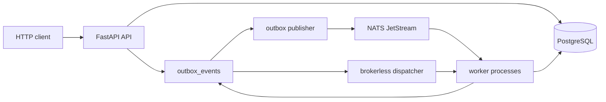
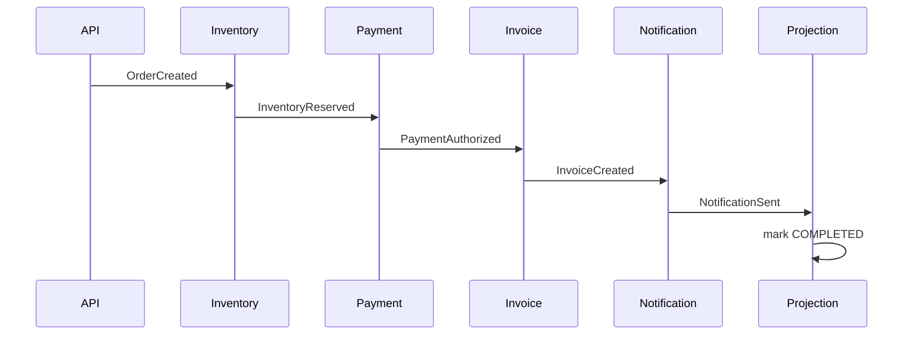

# EventCart

EventCart is a compact FastAPI backend for learning event-driven architecture
through an order workflow. It is built as a GitHub showcase project: small
enough to read, but complete enough to teach the patterns that make
at-least-once event delivery safe.

## What You Learn

EventCart demonstrates:

- Transactional outbox
- Idempotent command APIs
- Consumer inbox pattern
- At-least-once delivery
- NATS JetStream broker mode
- PostgreSQL brokerless mode with outbox polling and LISTEN/NOTIFY wake-ups
- Choreography-style saga workflow
- Compensation after payment failure
- Retry, dead-letter, and replay handling
- Correlation IDs, JSON logs, Prometheus metrics, and OpenTelemetry traces

## Architecture



The API and workers share one codebase, but workers are modeled as separate
process entrypoints. Business state and event state are stored in PostgreSQL.
The outbox table is the durable event handoff point.

## Workflow

Success path:

```txt
OrderCreated
  -> InventoryReserved
  -> PaymentAuthorized
  -> InvoiceCreated
  -> NotificationSent
  -> order COMPLETED
```

Failure path:

```txt
OrderCreated
  -> InventoryReserved
  -> PaymentFailed
  -> InventoryReleased
  -> order CANCELLED
```



## Tech Stack

- Python 3.12+
- FastAPI
- Pydantic v2
- SQLAlchemy 2.x
- Alembic
- PostgreSQL
- NATS JetStream
- Redis
- Pytest + HTTPX
- Ruff + Pyright
- OpenTelemetry
- Prometheus
- Grafana
- Jaeger
- Docker Compose

## Installation

Create a virtual environment and install the package with development tools:

```bash
python -m venv .venv
. .venv/bin/activate
python -m pip install --upgrade pip
python -m pip install -e ".[dev]"
```

Run local checks:

```bash
.venv/bin/ruff check .
.venv/bin/pyright
.venv/bin/python -m pytest
```

## Docker Compose Runtime

Start the full local stack:

```bash
docker compose up --build
```

Useful URLs:

```txt
API:        http://localhost:8000
Metrics:    http://localhost:8000/metrics
NATS:       http://localhost:8222
Prometheus: http://localhost:9090
Grafana:    http://localhost:3000
Jaeger:     http://localhost:16686
```

Docker services include:

```txt
api
postgres
redis
nats
otel-collector
prometheus
grafana
jaeger
```

## API Examples

Create an inventory item:

```bash
curl -X POST http://localhost:8000/api/v1/admin/inventory-items \
  -H "Content-Type: application/json" \
  -d '{
    "sku": "ticket-standard",
    "name": "Standard Ticket",
    "quantity_available": 100,
    "unit_price_cents": 4500
  }'
```

Create an order with an idempotency key:

```bash
curl -X POST http://localhost:8000/api/v1/orders \
  -H "Content-Type: application/json" \
  -H "Idempotency-Key: order-demo-1" \
  -H "X-Correlation-ID: demo-correlation-1" \
  -d '{
    "customer_email": "ada@example.com",
    "items": [
      {"sku": "ticket-standard", "quantity": 2}
    ]
  }'
```

Get an order:

```bash
curl http://localhost:8000/api/v1/orders/<order_id>
```

Read metrics:

```bash
curl http://localhost:8000/metrics
```

## Events

EventCart uses this envelope:

```json
{
  "event_id": "uuid",
  "event_type": "OrderCreated",
  "event_version": 1,
  "aggregate_type": "Order",
  "aggregate_id": "uuid",
  "correlation_id": "uuid",
  "causation_id": "uuid|null",
  "occurred_at": "2026-06-26T10:00:00Z",
  "payload": {}
}
```

Current event types:

- `OrderCreated`
- `InventoryReserved`
- `InventoryReservationFailed`
- `PaymentAuthorized`
- `PaymentFailed`
- `InvoiceCreated`
- `NotificationSent`
- `InventoryReleased`

## Idempotency

EventCart uses idempotency at three layers:

- API: `Idempotency-Key` stores request hash and response for duplicate command
  requests.
- Publisher: `event_id` is the publish identity and NATS message ID where
  supported.
- Consumer: `consumer_name + event_id` inbox rows prevent repeated side effects.

## Delivery Modes

NATS mode:

```txt
PostgreSQL outbox -> outbox publisher -> NATS JetStream -> workers -> DB
```

PostgreSQL brokerless mode:

```txt
PostgreSQL outbox -> polling dispatcher -> local worker handlers -> DB
```

Enable the brokerless mode with:

```txt
EVENTCART_EVENT_TRANSPORT=postgres
```

PostgreSQL `LISTEN/NOTIFY` is only a wake-up hint. Durability comes from
`outbox_events`; polling provides reliability.

## Retry, Dead Letter, And Replay

Failed brokerless handler attempts are recorded in
`event_processing_attempts`. Retryable events remain pending with
`next_attempt_at` set by a simple backoff policy. Poison events move to
`dead_letter_events` after the max attempt count.

Replay creates a new pending outbox event from a dead-letter row and marks the
DLQ row replayed. This preserves the original failure history and makes replay
an explicit operator action.

## Observability

EventCart includes:

- JSON structured logs
- `X-Correlation-ID` middleware
- event correlation and causation IDs
- Prometheus `/metrics`
- OpenTelemetry FastAPI instrumentation
- OTel Collector, Prometheus, Grafana, and Jaeger Compose services

## Deeper Docs

- [Curl examples](docs/examples/README.md)
- [Architecture diagrams](docs/diagrams/)
- [Architecture decisions](docs/architecture-decisions.md)
- [Architecture overview](docs/architecture/overview.md)
- [Order lifecycle](docs/domain/order-lifecycle.md)
- [Transactional outbox](docs/architecture/transactional-outbox.md)
- [NATS JetStream mode](docs/architecture/nats-jetstream-mode.md)
- [Idempotency](docs/architecture/idempotency.md)
- [Saga workflow](docs/architecture/saga-workflow.md)
- [Broker vs brokerless](docs/architecture/broker-vs-brokerless.md)
- [Retry, dead letter, and replay](docs/architecture/retry-dead-letter-replay.md)
- [Observability](docs/architecture/observability.md)
- [Testing guide](docs/testing-guide.md)

## Testing Guide

Run all tests:

```bash
.venv/bin/python -m pytest
```

Run quality checks:

```bash
.venv/bin/ruff check .
.venv/bin/pyright
```

The tests are intentionally educational. They show API behavior, event envelope
shape, outbox persistence, idempotency, worker side effects, brokerless dispatch,
retry, DLQ, replay, metrics, tracing setup, and Compose config validation.

## GitHub Showcase Notes

This repository is designed to be read phase by phase. The code favors explicit
modules and focused tests over hidden framework magic. Each architecture doc
explains one event-driven concept, and each test maps to a behavior worth
learning.
