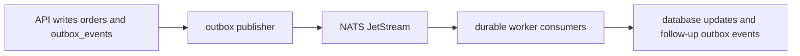
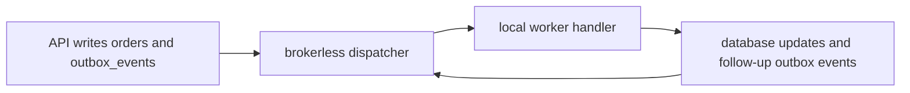

# Broker vs Brokerless Mode

EventCart supports two event delivery modes. Both start with the transactional
outbox, so business state and event state still commit together.

## Configuration

```txt
EVENTCART_EVENT_TRANSPORT=nats
EVENTCART_EVENT_TRANSPORT=postgres
```

`nats` is the default. `postgres` uses the outbox table, local handler routing,
polling, and optional PostgreSQL `LISTEN/NOTIFY` wake-ups.

## NATS JetStream Mode



NATS mode is the primary broker mode. It is useful when workers may run as
separate services, when event fan-out matters, or when broker features such as
durable consumers and replay are important.

In this mode, EventCart uses the event ID as the NATS message ID where JetStream
deduplication is available. Worker idempotency still lives in the inbox table,
because durable brokers can redeliver messages.

## PostgreSQL Brokerless Mode



Brokerless mode does not publish to NATS. Instead, a dispatcher polls pending
outbox rows and invokes local handler functions in the same application codebase.
When a handler writes a follow-up outbox event, the dispatcher picks that event
up on a later polling pass.

The success path can run entirely through PostgreSQL-backed state:

```txt
OrderCreated
  -> InventoryReserved
  -> PaymentAuthorized
  -> InvoiceCreated
  -> NotificationSent
  -> order COMPLETED
```

## LISTEN/NOTIFY

EventCart can call PostgreSQL `pg_notify` after an outbox row is flushed. A
brokerless dispatcher may `LISTEN` on the shared channel and wake up sooner than
its next polling interval.

Important: PostgreSQL `LISTEN/NOTIFY` is not durable broker storage.

Notifications can be missed if a dispatcher is disconnected or not listening.
Durability comes from `outbox_events`, not from `NOTIFY`. Polling remains the
reliability mechanism. `NOTIFY` only improves responsiveness.

## Tradeoffs

NATS mode:

- Better fit for separately deployed workers.
- Better fit for event fan-out and broker-managed delivery state.
- Adds a broker dependency and more runtime moving parts.

PostgreSQL brokerless mode:

- Smaller local runtime when PostgreSQL is already required.
- Easier to understand because events stay in one database-backed loop.
- Less suitable for broad fan-out or independently scaled worker fleets.
- Requires careful polling and idempotent handlers because the database outbox
  is doing the durable coordination work.

Both modes keep the same event envelope, outbox table, and consumer inbox
pattern. That is the main teaching point: transport can change without removing
the need for durable event records and idempotent side effects.
