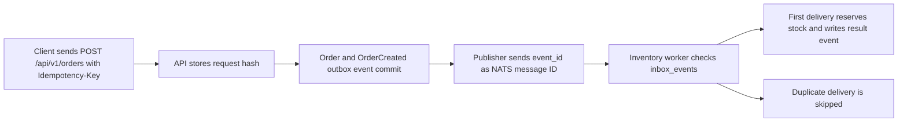

# Idempotency

EventCart uses idempotency so clients, publishers, and workers can retry safely.
The system still assumes at-least-once delivery: duplicates are expected, and
each layer has a small guard that makes repeated work harmless.

## Flow



## API Idempotency

Command endpoints can accept an `Idempotency-Key` header. EventCart currently
supports this on:

```txt
POST /api/v1/orders
```

For a new key, the API stores a canonical hash of the request body in
`idempotency_keys` before running the command. After a successful response, it
stores the response body and status code.

If the same key and same request body are sent again, the API returns the stored
response instead of creating another order. If the same key is reused with a
different request body, the API returns `409 Conflict`. If the original request
is still in progress and has no stored response yet, the duplicate also returns
`409 Conflict`.

Idempotency records expire after the configured service TTL, currently 24 hours
by default.

## Publisher Idempotency

Every event envelope has an `event_id`. The outbox publisher treats that ID as
the publish identity. In NATS JetStream mode, EventCart sends it in the
`Nats-Msg-Id` header so JetStream can deduplicate repeated publish attempts when
supported by the stream configuration.

The outbox table remains the durable source of truth. Publisher idempotency does
not replace the transactional outbox; it only makes retrying a publish less
likely to create duplicate broker messages.

## Consumer Idempotency

Workers use an inbox table keyed by:

```txt
consumer_name + event_id
```

Before handling an event, the worker checks whether that consumer has already
processed the event ID. The first delivery runs the handler and stores an
`inbox_events` marker in the same database session. Later deliveries for the
same consumer and event ID are skipped.

The inventory worker uses this pattern with the consumer name:

```txt
inventory-worker
```

That means replaying or redelivering the same `OrderCreated` event does not
reserve inventory twice and does not emit a second `InventoryReserved` or
`InventoryReservationFailed` event.

## Layer Responsibilities

- API idempotency prevents duplicate commands from creating duplicate orders.
- Publisher idempotency prevents repeated publish attempts from becoming
  repeated broker messages where the broker supports deduplication.
- Consumer idempotency protects business side effects from repeated delivery,
  replay, or worker restarts.

These layers work together. A durable broker can still redeliver messages, and a
publisher can still retry after uncertainty. EventCart therefore keeps
idempotency in the application data model rather than relying on transport
behavior alone.
