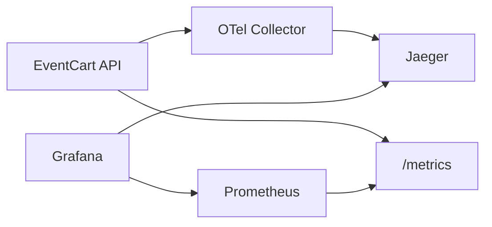

# Observability

EventCart keeps observability small but visible. The goal is to show how logs,
metrics, and traces help explain an event-driven workflow without making the
learning project heavy.

## Correlation IDs

The API accepts an `X-Correlation-ID` header. If a request does not provide one,
EventCart generates a new ID and returns it in the response header.

Order creation stores a correlation ID in the event envelope. Follow-up worker
events keep that same correlation ID and set `causation_id` to the event that
triggered the next local action.

```txt
OrderCreated(correlation_id=A)
  -> InventoryReserved(correlation_id=A, causation_id=OrderCreated)
  -> PaymentAuthorized(correlation_id=A, causation_id=InventoryReserved)
```

## Logs

Logs are JSON formatted. EventCart includes the active correlation ID when one
is available. Brokerless dispatch logs also include:

- `event_id`
- `event_type`
- `consumer_name`
- `correlation_id`

This makes it possible to search logs for one business flow even when several
workers process different parts of that flow.

## Metrics

The API exposes Prometheus metrics at:

```txt
GET /metrics
```

EventCart currently records HTTP request counts:

```txt
eventcart_http_requests_total{method, path, status_code}
```

Prometheus scrapes the API service from Docker Compose, and Grafana is
provisioned with Prometheus as a datasource.

## Traces

FastAPI is instrumented with OpenTelemetry. When
`OTEL_EXPORTER_OTLP_ENDPOINT` is configured, spans are exported to the OTel
Collector over OTLP HTTP.

In Docker Compose:



Jaeger receives traces from the collector. Grafana can read Prometheus metrics
and link to Jaeger as a datasource.

## Local Runtime Services

The observability Compose services are:

- `otel-collector`
- `prometheus`
- `grafana`
- `jaeger`

Docker is not required for unit tests. Tests validate that the API exposes
metrics, starts with tracing setup, and that the Compose observability YAML is
well formed. A full runtime check still requires Docker.
