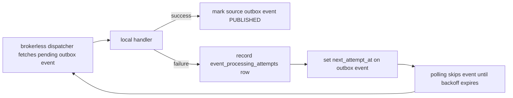
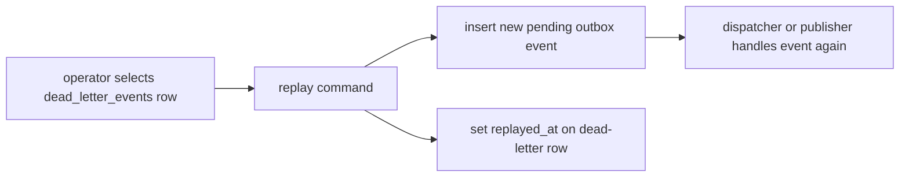

# Retry, Dead Letter, and Replay

EventCart treats failed event handling as part of the event-driven learning
surface. A worker may fail because of a temporary dependency issue, invalid
payload, code bug, or downstream state that is not ready yet.

## Retry Flow



On failure, EventCart records:

- `event_id`
- `consumer_name`
- `attempt_number`
- `error`
- `attempted_at`

The source outbox row remains `PENDING` while retries are still allowed. Its
`next_attempt_at` timestamp delays the next polling attempt. Polling remains the
durable mechanism: if the process restarts, the outbox row still carries the
retry state.

## Poison Events

A poison event is an event that keeps failing after the retry limit. Examples
include incompatible payload shape, missing required business state, or a bug in
the handler.

When the brokerless dispatcher reaches the configured max attempts, EventCart:

```txt
1. records the final processing attempt
2. writes a dead_letter_events row
3. marks the source outbox event FAILED
4. clears next_attempt_at
```

The failed outbox row is preserved as the original source of truth. The
dead-letter row is the operational queue for inspection and possible replay.

## Dead Letter Event Shape

`dead_letter_events` stores the original event identity and enough envelope data
to replay deliberately:

- original `event_id`
- `event_type` and `event_version`
- aggregate type and ID
- correlation and causation IDs
- failing `consumer_name`
- final `attempt_number`
- error message
- payload snapshot
- `failed_at`
- optional `replayed_at`

## Replay

Replay creates a new pending outbox event from a selected dead-letter row and
sets `replayed_at` on that row.



Replay does not mutate the failed source outbox event back to pending. That
keeps the failure history intact and makes duplicate replay easier to prevent.

## Replay Risks

Replay is powerful and should be deliberate:

- Replayed events get a new event ID, so consumer inbox idempotency treats them
  as intentional new deliveries.
- If the original side effect partially happened before failure, replay may
  repeat business work unless the handler is idempotent.
- Operators should inspect the payload and error first, then fix the underlying
  cause before replaying.
- Replay should be logged and audited in a real production system.

EventCart keeps replay explicit so readers can see the difference between
automatic retry, poison-event quarantine, and manual recovery.
