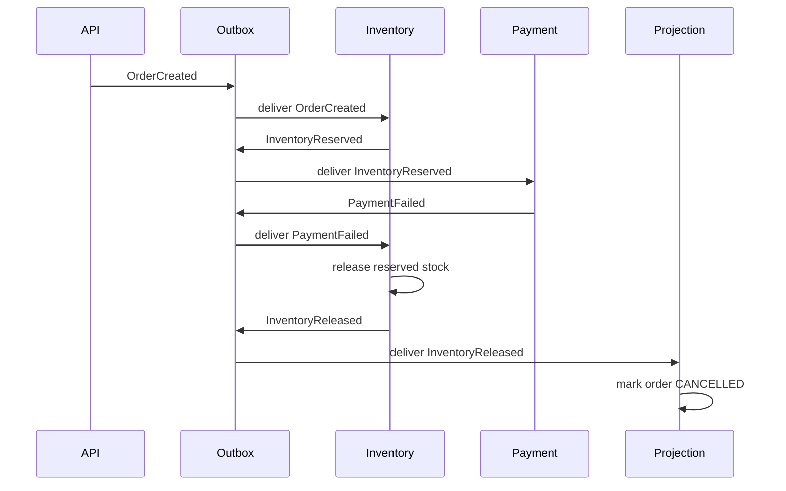

# Saga Workflow

EventCart uses a choreography-style saga: each worker reacts to an event, makes
one local state change, and writes the next event through the outbox. There is no
central orchestrator in this phase.

## Success Path

```mermaid
sequenceDiagram
    participant API
    participant Outbox
    participant Inventory
    participant Payment
    participant Invoice
    participant Notification
    participant Projection

    API->>Outbox: OrderCreated
    Outbox->>Inventory: deliver OrderCreated
    Inventory->>Outbox: InventoryReserved
    Outbox->>Payment: deliver InventoryReserved
    Payment->>Outbox: PaymentAuthorized
    Outbox->>Invoice: deliver PaymentAuthorized
    Invoice->>Outbox: InvoiceCreated
    Outbox->>Notification: deliver InvoiceCreated
    Notification->>Outbox: NotificationSent
    Outbox->>Projection: deliver NotificationSent
    Projection->>Projection: mark order COMPLETED
```



The successful chain is:

```txt
OrderCreated
  -> InventoryReserved
  -> PaymentAuthorized
  -> InvoiceCreated
  -> NotificationSent
  -> order COMPLETED
```

Each worker keeps the same order aggregate and carries the correlation ID
forward. The new event's causation ID is the event that triggered the local
worker action.

## Failure And Compensation Path



The failure chain is:

```txt
OrderCreated
  -> InventoryReserved
  -> PaymentFailed
  -> InventoryReleased
  -> order CANCELLED
```

`PaymentFailed` does not directly cancel the order. EventCart first releases the
reserved inventory and then projects `InventoryReleased` into the cancelled
order state. This keeps compensation visible in the event history.

## Current Simulation Boundary

This phase does not integrate with a real payment provider, invoice provider, or
email provider. Payment failure is simulated in tests with a
`payment_should_fail` flag on the `InventoryReserved` event payload. The
important learning behavior is the event chain and compensation shape, not the
external provider integration.

## Idempotency

Workers use the consumer inbox pattern from the idempotency phase. Replayed or
redelivered events are skipped per consumer name and event ID, so the same
workflow event should not reserve stock, create payments, create invoices, send
notifications, release stock, or update order status twice.
