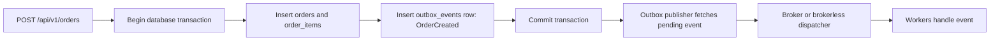

# Transactional Outbox

The transactional outbox keeps business state and event state in the same
database transaction. EventCart uses it so order creation can be durable before
any broker or worker is involved.

## The Dual-Write Problem

A direct implementation might save an order, then publish `OrderCreated` to a
broker:

```txt
1. INSERT order
2. Publish OrderCreated
```

If the process crashes after step 1 but before step 2, the order exists without
an event. If the event is published before the database commit succeeds,
workers may observe an event for business state that does not exist.

## EventCart Flow

EventCart writes both the order and its outbox event before committing:



The current phase stops at the durable pending outbox row. Later phases add the
publisher and consumers.

## Outbox Event Shape

Each row stores the event envelope:

- `event_id`
- `event_type`
- `event_version`
- `aggregate_type`
- `aggregate_id`
- `correlation_id`
- `causation_id`
- `occurred_at`
- `payload`

Publishing state is tracked separately with `status`, `published_at`,
`failure_count`, and `last_error`.

## Why This Helps

The database commit is the source of truth. If a publisher crashes, the pending
outbox row remains available for retry. If publishing succeeds, the row can be
marked `PUBLISHED`. If publishing fails, the row records failure metadata so a
later retry or dead-letter policy can make progress.
